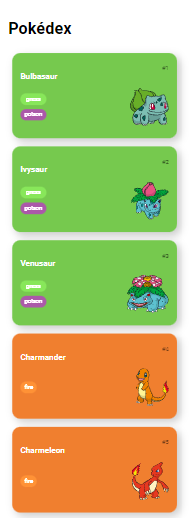
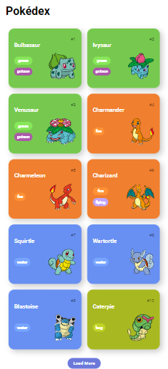
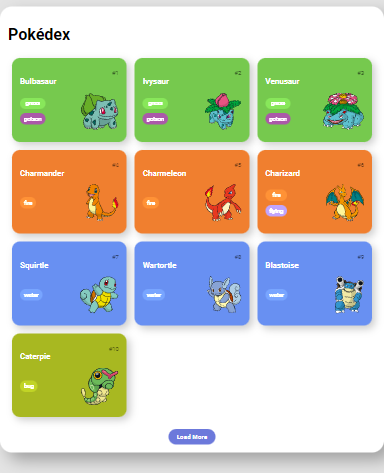
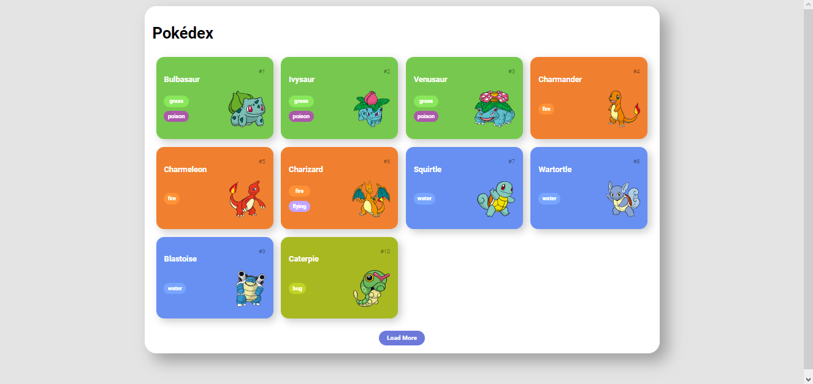

# DIO Construindo uma Pokédex com JavaScript

Esse projeto foi desenvolvido no curso de JavaScritp da [DIO](https://dio.me) e teve como objetivo a implementação dos conceitos aprendidos ao longo do curso para o desenvolvimento de uma pokedex.

## Índice

- [Resumo](#Resumo)
  - [O desafio](#o-desafio)
  - [Screenshot](#screenshot)
  - [Links](#links)
- [Autor](#autor)

## Resumo

### O desafio

Os alunos deveriam utilizar os conhecimentos previamente adquiridos nos cursos de HTML e CSS, assim como os do curso atual de JavaScript e desenvolver uma página que utiliza as informações fornecidas pela pokeAPI para a criação de uma pokedex dinâmica.

### Screenshot

### Links

- [Solução](https://tamiresataide.github.io/js-developer-pokedex/)
- [DIO](https://dio.me)

## Autor

- [Linkedin](https://www.linkedin.com/in/tamiresataide/)
- [GitHub](https://github.com/tamiresataide)

